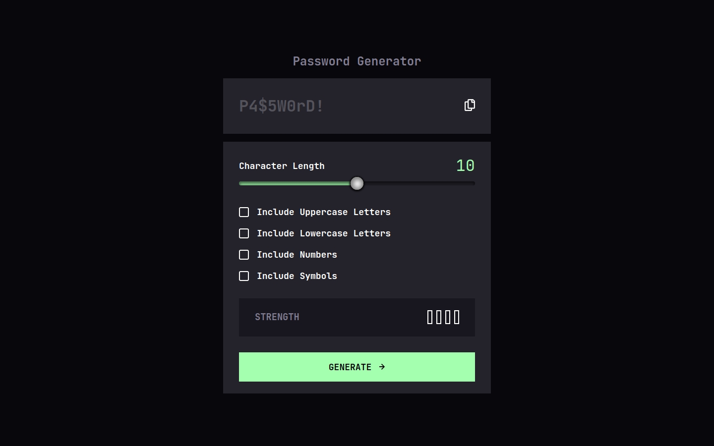

# Frontend Mentor - Password generator app solution

This is a solution to the [Password generator app challenge on Frontend Mentor](https://www.frontendmentor.io/challenges/password-generator-app-Mr8CLycqjh). Frontend Mentor challenges help you improve your coding skills by building realistic projects. 

## Table of contents

### Links

- Solution URL: [Add solution URL here](https://rf1303.github.io/Password-generator-app/)
- Live Site URL: [Add live site URL here](https://github.com/rf1303/Password-generator-app)

## My process

### Built with

- Semantic HTML5 markup
- CSS custom properties
- Flexbox
- CSS Grid
- Mobile-first workflow
-  JS 
- zxcvbn.js 
- https://github.com/dropbox/zxcvbn 

**Note: These are just examples. Delete this note and replace the list above with your own choices**

### What I learned

Use this section to recap over some of your major learnings while working through this project. Writing these out and providing code samples of areas you want to highlight is a great way to reinforce your own knowledge.

To see how you can add code snippets, see below:

### Useful resources

- [Example resource 1](https://github.com/dropbox/zxcvbn) - 
## Author

- Frontend Mentor - [@yourusername](https://www.frontendmentor.io/profile/yourusername)
